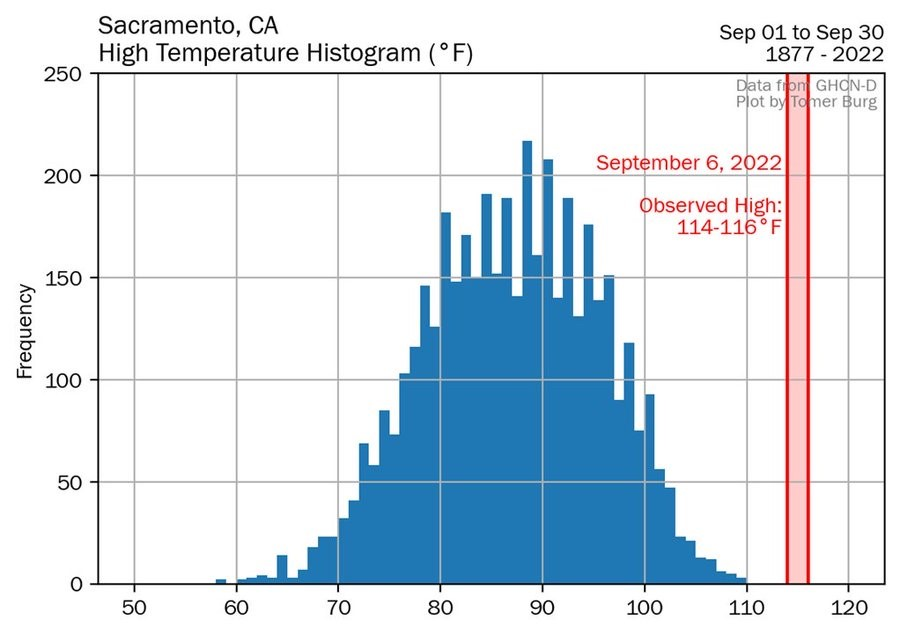

## Dangerous Weather

> And it never failed that during the dry years the people forgot about the rich years, and during the wet years they lost all memory of the dry years.  
> It was always that way. 

- John Steinbeck, East of Eden 

### California and Drought-Flood Cycles 

### Floods

The Great Flood of 1862

February 9, 1862, Brewer wrote:
Nearly every house and farm over this immense region is gone. Th ere
was such a body of water—250 to 300 miles long and 20 to 60 miles wide,
the water ice cold and muddy—that the winds made high waves which
beat the farm homes in pieces. America has never before seen such
desolation by fl ood as this has been, and seldom has the Old World seen the
like. (p. 244)

### Over 30 Inches of Rain - Three Times Historical Average

### Most of Central Valley Was Underwater

### Canoes in Downtown Sacramento 

### Hotest Day on Record in Sacramento (And In September!)

## Climate and Production

- Climate change will do damage to economies.  The American South might experience some of the worse trouble 

